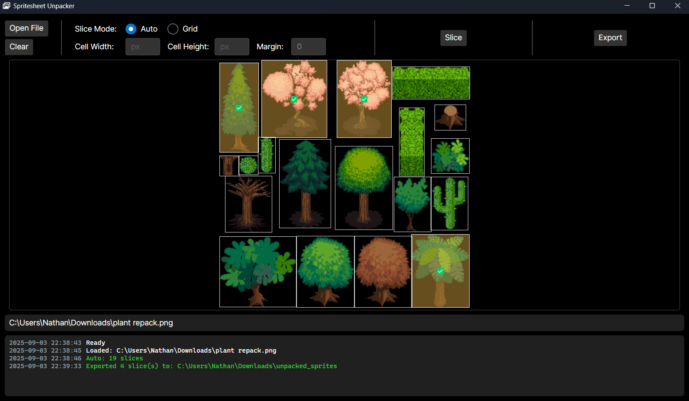

# Spritesheet Unpacker

A simple Avalonia app to slice spritesheets (auto or grid) and export selected slices. This can help in game development when you want to use only a few images from a spritesheet.

This was primarily an excuse to learn how to build a desktop app in .NET. 

## Features
- **Auto mode**: find irregular sprites by transparency.
- **Grid mode**: slice by fixed cell size (+ margin).
- **Preview & selection**: click to select slices, then export only selected ones.

## Quick start
1. `dotnet build .\src\SpritesheetUnpacker\SpritesheetUnpacker.csproj -c Debug; if ($LASTEXITCODE -eq 0) { dotnet run --project .\src\SpritesheetUnpacker\SpritesheetUnpacker.csproj -c Debug }`
2. Open an image, choose a slice mode, select images, then export
3. Profit?

## Tests
`dotnet test ./src/SpritesheetUnpacker.Tests/SpritesheetUnpacker.Tests.csproj -c Debug`
